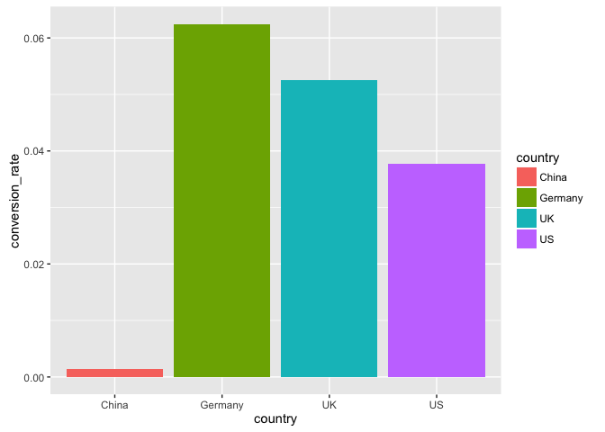
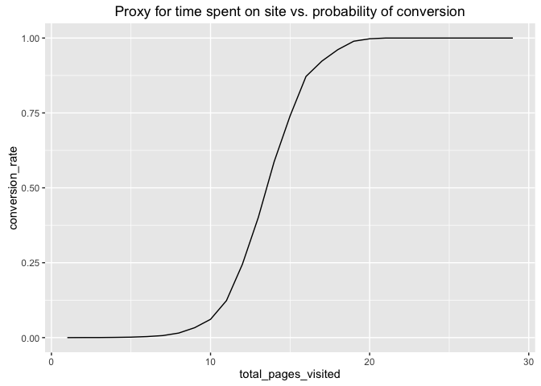
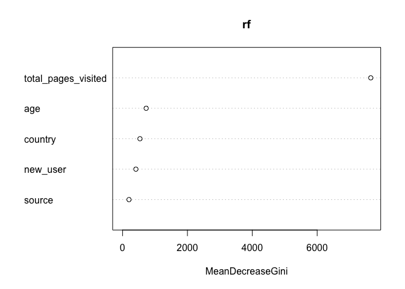
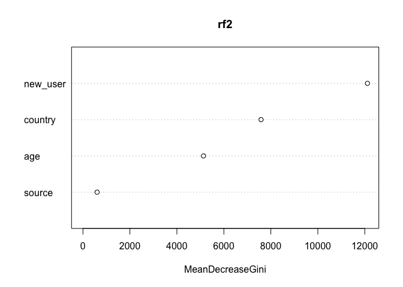
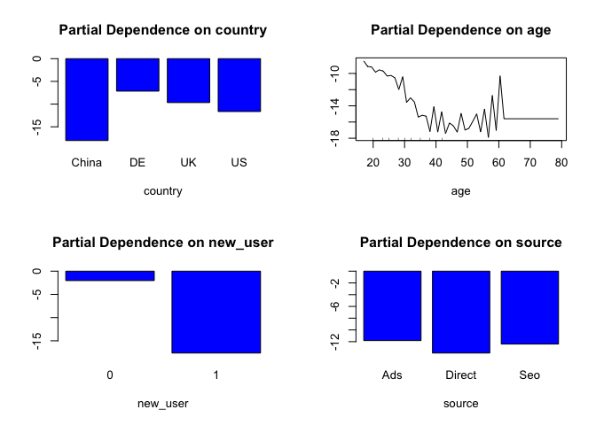

NOTE :
------

If you're new to RStudio, you may need to download these packages to be able to knit this document:

``` r
install.packages("rmarkdown")
install.packages("dplyr")
install.packages("ggplot2")
install.packages("randomForest")
```

You also need to change the working directory in line 29 of this `.Rmd` file.

Knitting will take a little while especially at 96%, so just sit tight lol.

Exploratory Analytics
---------------------

``` r
setwd("/Users/tomjeon/ugrid/Proj_1") # you need to change this to your own wd
dat <- read.csv("conversion_data.csv")
head(dat)
```

    ##   country age new_user source total_pages_visited converted
    ## 1      UK  25        1    Ads                   1         0
    ## 2      US  23        1    Seo                   5         0
    ## 3      US  28        1    Seo                   4         0
    ## 4   China  39        1    Seo                   5         0
    ## 5      US  30        1    Seo                   6         0
    ## 6      US  31        0    Seo                   1         0

``` r
str(dat) # structure of data
```

    ## 'data.frame':    316200 obs. of  6 variables:
    ##  $ country            : Factor w/ 4 levels "China","Germany",..: 3 4 4 1 4 4 1 4 3 4 ...
    ##  $ age                : int  25 23 28 39 30 31 27 23 29 25 ...
    ##  $ new_user           : int  1 1 1 1 1 0 1 0 0 0 ...
    ##  $ source             : Factor w/ 3 levels "Ads","Direct",..: 1 3 3 3 3 3 3 1 2 1 ...
    ##  $ total_pages_visited: int  1 5 4 5 6 1 4 4 4 2 ...
    ##  $ converted          : int  0 0 0 0 0 0 0 0 0 0 ...

First thing I do is to look for weird data points that suggests wrong data. I've already cleaned the data when I uploaded the project, but I put wrong data points in there on purpose.

``` r
summary(dat)
```

    ##     country            age            new_user         source      
    ##  China  : 76602   Min.   : 17.00   Min.   :0.0000   Ads   : 88740  
    ##  Germany: 13056   1st Qu.: 24.00   1st Qu.:0.0000   Direct: 72420  
    ##  UK     : 48450   Median : 30.00   Median :1.0000   Seo   :155040  
    ##  US     :178092   Mean   : 30.57   Mean   :0.6855                  
    ##                   3rd Qu.: 36.00   3rd Qu.:1.0000                  
    ##                   Max.   :123.00   Max.   :1.0000                  
    ##  total_pages_visited   converted      
    ##  Min.   : 1.000      Min.   :0.00000  
    ##  1st Qu.: 2.000      1st Qu.:0.00000  
    ##  Median : 4.000      Median :0.00000  
    ##  Mean   : 4.873      Mean   :0.03226  
    ##  3rd Qu.: 7.000      3rd Qu.:0.00000  
    ##  Max.   :29.000      Max.   :1.00000

So few things from this:

-   the site is probably US, although Chinese presence is strong.
-   user base is pretty young
-   conversion rate is ~3%
-   everything seems to make sense except max age is 123 years...

Let's investigate:

``` r
sort(unique(dat$age), decreasing = TRUE)
```

    ##  [1] 123 111  79  77  73  72  70  69  68  67  66  65  64  63  62  61  60
    ## [18]  59  58  57  56  55  54  53  52  51  50  49  48  47  46  45  44  43
    ## [35]  42  41  40  39  38  37  36  35  34  33  32  31  30  29  28  27  26
    ## [52]  25  24  23  22  21  20  19  18  17

``` r
subset(dat, age > 100)
```

    ##        country age new_user source total_pages_visited converted
    ## 90929  Germany 123        0    Seo                  15         1
    ## 295582      UK 111        0    Ads                  10         1

Ok, so it's just two users. Not a big deal. We can just remove them and nothing would change. In general, depending on the problem, you can

-   remove the entire row, saying you just don't trust any data associated with that
-   treat those values (in this case `age`) as `NA`s
-   if there is a pattern, try to figure out what went wrong (schema design, some fundamental flaw in data collection process)

When you have a lot of data as we do here, it's safest to just delete the row.

``` r
clean_dat <- subset(dat, age < 80) # just to be extra conservative
```

Now, let’s quickly investigate the variables and how their distribution differs for the two classes. This will help us understand whether there is any information in our data in the first place and get a sense of the data.

**It's good practice to always get a sense of the data before building any models.**

I'll just pick a couple of variables as an example, but you should do it with all:

``` r
library(dplyr)
```

    ## 
    ## Attaching package: 'dplyr'

    ## The following objects are masked from 'package:stats':
    ## 
    ##     filter, lag

    ## The following objects are masked from 'package:base':
    ## 
    ##     intersect, setdiff, setequal, union

``` r
dat_country <- clean_dat %>%
  group_by(country) %>%
  summarise(conversion_rate = mean(converted))
  
# Visualizing above information
library(ggplot2)
ggplot(dat_country, aes(x = country, y = conversion_rate)) +
  geom_bar(stat = "identity", aes(fill = country))
```



So it's apparent that the Chinese convert at a much lower rate than other countries.

``` r
dat_pages <- clean_dat %>%
  group_by(total_pages_visited) %>%
  summarise(conversion_rate = mean(converted))

# Plot
qplot(total_pages_visited, conversion_rate, data = dat_pages, geom = "line",
      main = "Proxy for time spent on site vs. probability of conversion")
```



I just want to mention that on these projects, focus on your strengths and interests. If visualization is your main strength/interest, spend as much time as you wish on that and come up with something great. If you ahve other strengths and interests, spend more time on those. These projects are pretty open-ended by design. By seeing where you spend more time, we each can also understand your strengths/interests and where you'd fit best in the future.

Predictive Analytics
--------------------

The goal for this project was to predict conversion rate. The outcome is binary so this is a *classification* problem. You care about insights to give product and marketing teams some ideas. Here are some of the methodologies you can use for a classification problem:

-   Logistic regression
-   Decision trees
-   RuleFit
-   Random Forest

I am going to pick a random forest to predict conversion rate. I pick a random forest because it usually requires very little time to optimize the parameters and it is strong with outliers, irrelevant variables, continuous and discrete variables. I'll use its partial dependence plots and variable importance to get insights about how the model got information from the data. Also, I will build a simple tree to find the most obvious user segments and see if they agree with RF partial dependence plots.

First, `converted` should really be a factor as well as `new_user`. Let's change them:

``` r
clean_dat$converted <- as.factor(clean_dat$converted)
clean_dat$new_user <- as.factor(clean_dat$new_user)
levels(clean_dat$country)[levels(clean_dat$country) == "Germany"] = "DE" # easier to plot shorter names

# Test/training sets
train_sample <- sample(nrow(clean_dat), size = nrow(clean_dat) * 0.66)
train_dat <- clean_dat[train_sample, ]
test_dat <- clean_dat[-train_sample, ]

# Random forest
library(randomForest)
```

    ## randomForest 4.6-12

    ## Type rfNews() to see new features/changes/bug fixes.

    ## 
    ## Attaching package: 'randomForest'

    ## The following object is masked from 'package:ggplot2':
    ## 
    ##     margin

    ## The following object is masked from 'package:dplyr':
    ## 
    ##     combine

``` r
rf <- randomForest(y = train_dat$converted, x = train_dat[, -ncol(train_dat)],
                   ytest = test_dat$converted, xtest = test_dat[, -ncol(train_dat)],
                   ntree = 20, mtry = 3, keep.forest = TRUE)
rf
```

    ## 
    ## Call:
    ##  randomForest(x = train_dat[, -ncol(train_dat)], y = train_dat$converted,      xtest = test_dat[, -ncol(train_dat)], ytest = test_dat$converted,      ntree = 20, mtry = 3, keep.forest = TRUE) 
    ##                Type of random forest: classification
    ##                      Number of trees: 20
    ## No. of variables tried at each split: 3
    ## 
    ##         OOB estimate of  error rate: 1.49%
    ## Confusion matrix:
    ##        0    1 class.error
    ## 0 200959  926  0.00458677
    ## 1   2193 4588  0.32340363
    ##                 Test set error rate: 1.44%
    ## Confusion matrix:
    ##        0    1 class.error
    ## 0 103641  451 0.004332706
    ## 1   1101 2315 0.322306792

So, OOB error and test error are pretty similar... This means that we're not overfitting. Error is pretty low at about 1.5%.

Let's check variable importance:

``` r
varImpPlot(rf, type = 2)
```



Total pages visited is the most important by far. Unfortunately, it is probably the least "actionable". People might visit many pages because they already know what they want to buy and in order to buy things you have to click on more pages.

Let's build the random forest without that variable. Since classes are heavily unbalanced and we don't have that very powerful variable anymore, I changed the weight a bit, just to make sure I'll get something classified as 1.

``` r
rf2 <- randomForest(y = train_dat$converted, x = train_dat[, -c(5, ncol(train_dat))],
                   ytest = test_dat$converted, xtest = test_dat[, -c(5, ncol(train_dat))],
                   ntree = 20, mtry = 3, classwt = c(0.7, 0.3), keep.forest = TRUE)
rf2
```

    ## 
    ## Call:
    ##  randomForest(x = train_dat[, -c(5, ncol(train_dat))], y = train_dat$converted,      xtest = test_dat[, -c(5, ncol(train_dat))], ytest = test_dat$converted,      ntree = 20, mtry = 3, classwt = c(0.7, 0.3), keep.forest = TRUE) 
    ##                Type of random forest: classification
    ##                      Number of trees: 20
    ## No. of variables tried at each split: 3
    ## 
    ##         OOB estimate of  error rate: 14.32%
    ## Confusion matrix:
    ##        0     1 class.error
    ## 0 175105 26785   0.1326713
    ## 1   3096  3686   0.4565025
    ##                 Test set error rate: 13.99%
    ## Confusion matrix:
    ##       0     1 class.error
    ## 0 90599 13493   0.1296257
    ## 1  1552  1864   0.4543326

Accuracy went down as expected but whatever. Model is still good to get some insights.

Rechecking variable importance:

``` r
varImpPlot(rf2, type = 2)
```



Interesting. `new_user` is most important one now. Source doesn't seem to matter at all.

Now partial dependence plots for the 4 variables:

``` r
library(rpart)
op <- par(mfrow = c(2, 2))
partialPlot(rf2, train_dat, country, 1)
partialPlot(rf2, train_dat, age, 1)
partialPlot(rf2, train_dat, new_user, 1)
partialPlot(rf2, train_dat, source, 1)
```



So this shows that:

-   Users with an old account are much better than new users
-   China is really bad
-   The site works well for young people and bad for less young people (&gt; 30 yrs)
-   Source is irrelevant

Some conclusions and suggestions:

-   The site is working very well for young users. Definitely let’s tell marketing to advertise and use marketing channel which are more likely to reach young people.
-   The site is working very well for Germany in terms of conversion. But the summary showed that there are few Germans coming to the site: way less than UK, despite a larger population. Again, marketing should get more Germans. Big opportunity.
-   Users with old accounts do much better. Targeted emails with offers to bring them back to the site could be a good idea to try.
-   Something is wrong with the Chinese version of the site. It is either poorly translated, doesn’t fit the local culture, some payment issue or maybe it is just in English! Given how many users are based in China, fixing this should be a top priority. Huge opportunity.
-   Maybe go through the UI and figure out why older users perform so poorly? From 30 y/o conversion clearly starts dropping.
-   If I know someone has visited many pages, but hasn’t converted, she almost surely has high purchase intent. I could email her targeted offers or sending her reminders. Overall, these are probably the easiest users to make convert.

As you can see, conclusions usually end up being about:

-   Tell marketing to get more of the good performing user segments.
-   Tell product to fix the experience for the bad performing ones.
